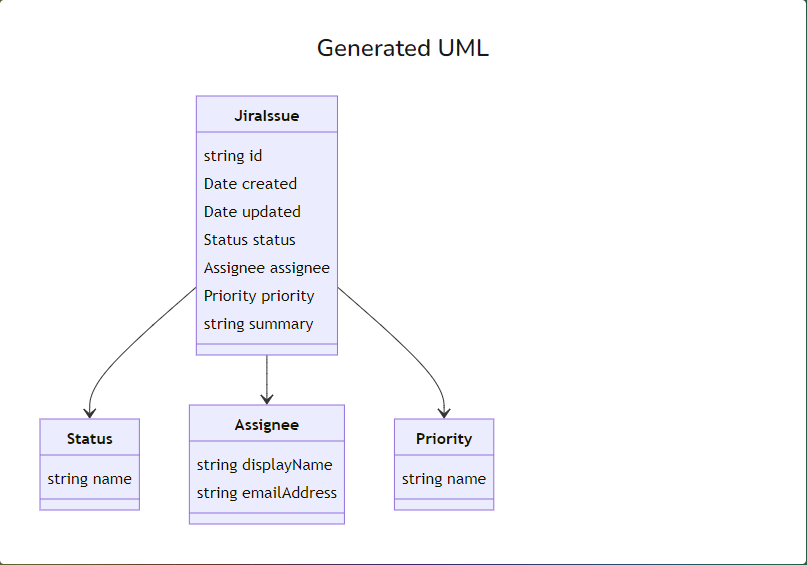
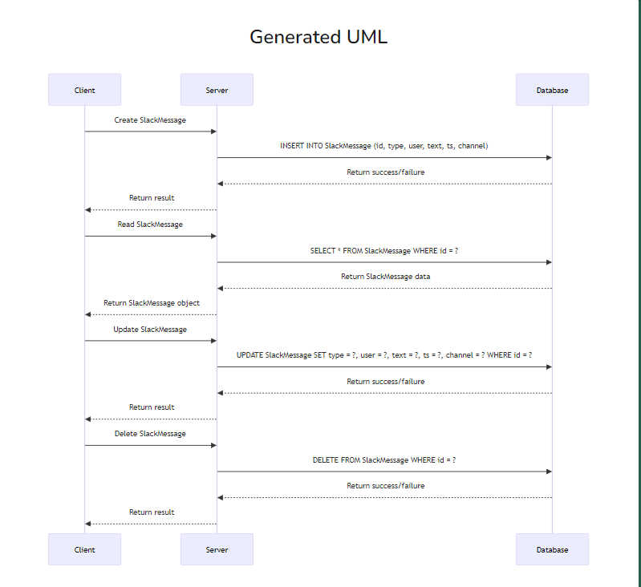
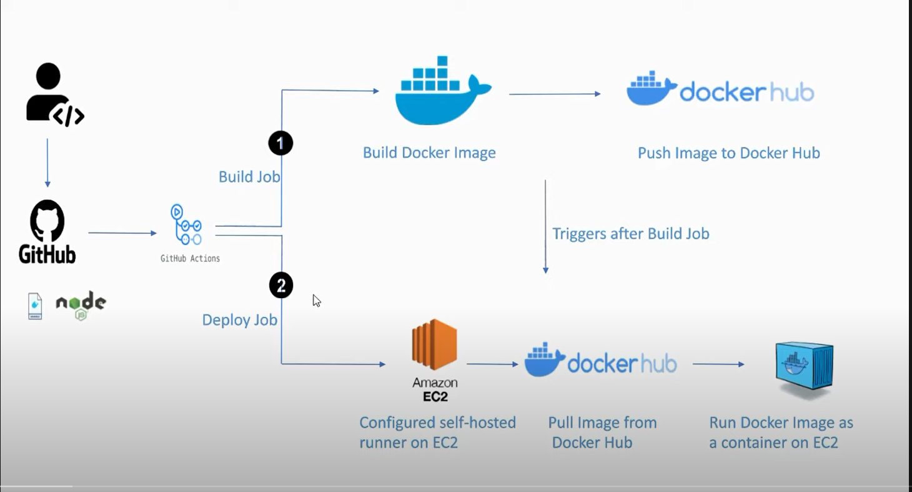

# Project: AYOMITIDE-OAJ/jira-slack-backend-api

## Table of Contents
1. [Project Overview](#project-overview)
2. [Setup Instructions](#setup-instructions)
3. [API Endpoints](#api-endpoints)
4. [Data Schema Diagram](#data-schema-diagram)
5. [PostgreSQL Interaction](#postgresql-interaction)
6. [Deployment Documentation](#deployment-documentation)
7. [Maintenance Guide](#maintenance-guide)

---

### Project Overview
This project is a **Jira-Slack backend API** built using the **NestJS** framework. It integrates with Jira and Slack, allowing for interaction and data synchronization between these two platforms. The project employs **TypeORM** for database interaction and uses **PostgreSQL** as the database.

### Setup Instructions
To set up the project, follow these steps:

1. **Clone the Repository**
   ```bash
   git clone <repository-url>
   cd jira-slack-backend-api
   ```

2. **Install Dependencies**
   ```bash
   npm install
   ```

3. **Environment Configuration**
   Create a `.env` file in the root directory of the project and add your configurations. Use the `.env.example` file as a guide.
   ```env
   DATABASE_URL=your-database-url
   SLACK_API_TOKEN=your-slack-api-token
   JIRA_EMAIL=your-jira-email
   JIRA_API_TOKEN=your-jira-api-token
   JIRA_DOMAIN=your-jira-domain
   ```

4. **Running the Application**
   ```bash
   npm run start
   ```

5. **Running in Development Mode**
   ```bash
   npm run start:dev
   ```

### API Endpoints

#### Swagger
The API documentation is provided through Swagger. Once the application is running, navigate to `/api/docs` to view interactive API documentation.

You can also find the swagger doc json file here: [swagger doc json](https://github.com/AYOMITIDE-OAJ/jira-slack-backend-api/blob/main/swagger_documentation.json)

or the postman doc [postman doc json](https://documenter.getpostman.com/view/19211919/2sA3kYizzE)

#### Slack Controller
- **Fetch Slack Messages**
  ```http
  GET /slack/fetch/:channelName
  ```
  Fetches and stores messages from a specific Slack channel.

- **Fetch All Channels**
  ```http
  GET /slack/fetch-channels
  ```
  Retrieves all Slack channels.

- **Send Message to Slack Channel**
  ```http
  POST /slack/messages/send
  ```
  Sends a message to a Slack channel.
  - Body Parameters:
    ```json
    {
      "channelName": "string",
      "message": "string"
    }
    ```

#### Jira Controller
- **Fetch All Jira Issues**
  ```http
  GET /jira/fetch-issues
  ```
  Retrieves all Jira issues.

- **Fetch Jira Issues**
  ```http
  GET /jira/fetch
  ```
  Retrieves Jira issues from Jira API.

### Data Schema Diagram

 

Here is a simplified representation of the data schema:

**SlackMessage Entity**
| Column | Type    | Description          |
|--------|---------|----------------------|
| id     | uuid    | Primary Key          |
| type   | string  | Type of Slack message|
| user   | string  | User ID              |
| text   | string  | Message text         |
| ts     | string  | Timestamp            |
| channel| string  | Channel ID (nullable)|

**JiraIssue Entity**
| Column      | Type    | Description               |
|-------------|---------|---------------------------|
| id          | string  | Primary Key               |
| created     | Date    | Creation date             |
| updated     | Date    | Updated date              |
| summary     | string  | Issue summary             |
| status      | object  | Issue status              |
| assignee    | object  | Assignee details          |
| priority    | object  | Issue priority            |

### PostgreSQL Interaction
The project uses **TypeORM** to interact with the PostgreSQL database. The entities, `SlackMessage` and `JiraIssue`, are used for ORM mapping. Here’s a typical configuration for the data source:

```typescript
import { ConfigService } from '@nestjs/config';
import { JiraIssue } from 'src/modules/jira/entities';
import { SlackMessage } from 'src/modules/slack/entities';
import { DataSource } from 'typeorm';
import { URL } from 'url';

export const createDataSource = (configService: ConfigService) => {
  const databaseUrl = configService.get<string>('DATABASE_URL');
  let typeOrmConfig: any = {
    type: 'postgres',
    entities: [SlackMessage, JiraIssue],
    synchronize: true,
  };
  if (databaseUrl) {
    const dbUrl = new URL(databaseUrl);
    typeOrmConfig = {
      ...typeOrmConfig,
      host: dbUrl.hostname,
      port: parseInt(dbUrl.port, 10),
      username: dbUrl.username,
      password: dbUrl.password,
      database: dbUrl.pathname.slice(1),
      ssl: {
        rejectUnauthorized: false,
      },
    };
  } else {
    typeOrmConfig = {
      ...typeOrmConfig,
      host: configService.get<string>('DATABASE_HOST'),
      port: configService.get<number>('DATABASE_PORT'),
      username: configService.get<string>('DATABASE_USER'),
      password: configService.get<string>('DATABASE_PASS'),
      database: configService.get<string>('DATABASE_NAME'),
    };
  }
  return new DataSource(typeOrmConfig);
};
```

### Deployment Documentation



#### Dockerized EC2 Environment Setup

1. **Install Docker on EC2**
   ```bash
   sudo apt-get update
   sudo apt-get install docker.io
   ```

2. **Clone the Repository**
   ```bash
   git clone <repository-url>
   cd jira-slack-backend-api
   ```

3. **Build Docker Image**
   ```bash
   docker build -t jira-slack-backend-api .
   ```

4. **Run Docker Container**
   ```bash
   docker run -d -p 3000:3000 --env-file .env jira-slack-backend-api
   ```

5. **Verify Deployment**
   Access the application at `http://<ec2-ip>:3000`.

### Maintenance Guide

#### Updating the Application

1. **Login to EC2**
   ```bash
   ssh -i <your-ec2-key.pem> ubuntu@<ec2-ip>
   ```

2. **Navigate to Project Directory**
   ```bash
   cd jira-slack-backend-api
   ```

3. **Pull Latest Changes**
   ```bash
   git pull origin main
   ```

4. **Rebuild Docker Image**
   ```bash
   docker build -t jira-slack-backend-api .
   ```

5. **Restart Container**
   ```bash
   docker stop <container-id>
   docker rm <container-id>
   docker run -d -p 3000:3000 --env-file .env jira-slack-backend-api
   ```

#### Monitoring and Logs

- **Access Logs**
  ```bash
  docker logs <container-id>
  ```

- **Monitor Health**
  Use Docker commands to check running containers and resource usage.

By following these detailed steps and guidelines, you can successfully set up, deploy, and maintain the Jira-Slack backend API project.